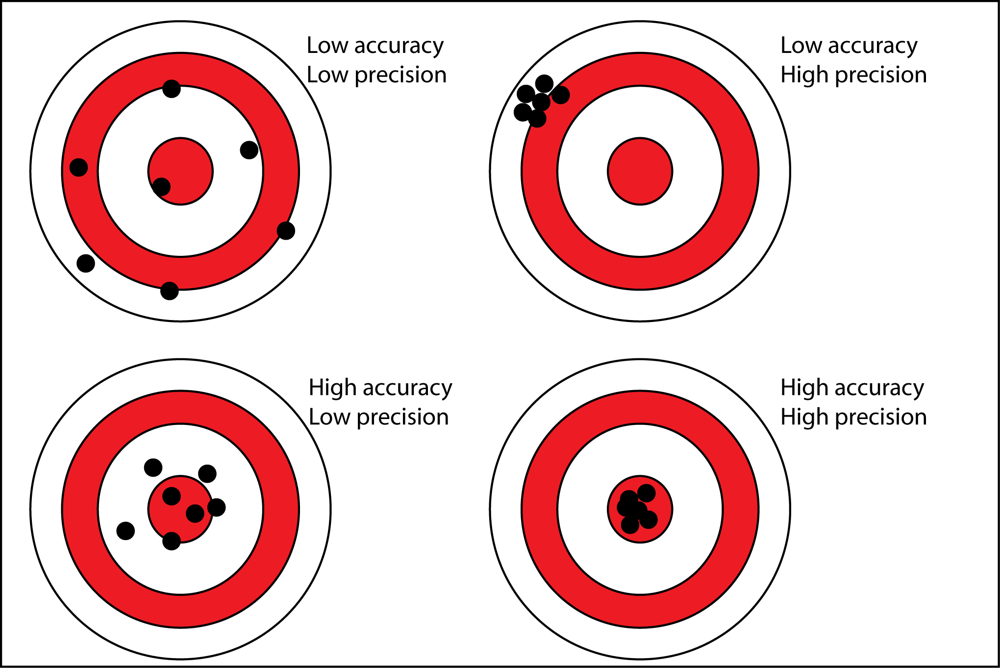

<style>
em {
  font-style: italic
}
</style>
<style>
strong {
  font-weight: bold;
}
body {
  background-color: #000;
}
</style>

<!-- Limit image width and height -->
<style type="text/css">
img {     
  max-height: 500px;     
  max-width: 900px; 
}
</style>

## Roadmap - This is just a guess

 - Biostatistics - 20 minutes
  - Accuracy versus Precision - 2 minutes
  - Statistical Inference - 3 minutes
  - Distributions - 5 minutes
  - Hypothesis Testing - 10 minutes
 - Epidemiology - 40 minutes
  - Types of Prevention and Outbreaks - 4 minutes
  - Measures of Morbidity and Mortality - 5 minutes
  - Validity and Reliability of Clinical Tests - 6 minutes
  - Measures of Risk - 10 minutes
  - Epidemiological Biases - 5 minutes
  - Types of Studies - 10 minutes

--- .segue
## Biostatistics

--- &vcenter
## There are some important random terms

> - Generalizability
  - How applicable is a finding to the general population
<br>
> - P-value
  - Probability of finding a value this extreme by random chance
<br>
> - Confidence Interval
  - Interval over which population value is found with a specified probability (e.g. 95%)
<br>
> - Efficacy
  - Performance of treatment under ideal circumstances
<br>
> - Effectiveness
  - Performance of treatment under real world circumstances

--- &vcenter
## Precision is repeatability, Accuracy is closeness



--- .segue
## Describing Distributions

--- &twocolumn
## Statistical distributions have invariant properties

***=left
```{r, message=FALSE, warning=FALSE, echo=FALSE}
library(ggplot2)
library(cowplot)
norm <- rnorm(10000, sd = 1)
ggplot(data.frame(data = norm), aes(data)) + 
  geom_histogram(binwidth = 0.2) + 
  xlim(-10, 10) + 
  ylim(0, 950) +
  ggtitle("Normal Distribution") + 
  labs(x="", y="") +
  annotate("text", x = -10, y = 950, label = "Mean = Median = Mode", size=5, hjust = 0) +
  annotate("text", x = -10, y = 900, label = "68.3% CI ~ Mean +- 1 SD", size=5, hjust = 0) +
  annotate("text", x = -10, y = 850, label = "95.5% CI ~ Mean +- 2 SD", size=5, hjust = 0) +
  annotate("text", x = -10, y = 800, label = "99.7% CI ~ Mean +- 3 SD", size=5, hjust = 0)
```

***=right
```{r, message=FALSE, warning=FALSE, echo=FALSE}
library(ggplot2)
library(cowplot)
studentt <- rt(10000, df=2)
ggplot(data.frame(data = studentt), aes(data)) + 
  geom_histogram(binwidth = 0.2)  + 
  xlim(-10, 10) + 
  ylim(0, 950) +
  ggtitle("Student t Distribution") + 
  labs(x="", y="") +
  annotate("text", x = -10, y = 950, label = "Mean = Median = Mode", size=5, hjust = 0) +
  annotate("text", x = -10, y = 900, label = "95% CI depends on degrees of freedom", size=5, hjust = 0)
```

---  &radio
## Question #1

Investigators are studying prostate specific antigen (PSA) as a predictor for prostate cancer. To make the statistics easier, they are going to assume that PSA is a normally distributed population variable. Which of the following is correct under their assumption?

1. Mode is greater than median
2. Median is greater than mode
3. 95% CI depends on degrees of freedom
4. _Median is equal to mean_
5. Mean is equal to standard deviation

***.hint
The normal distribution is unimodal and symmetric.

***.explanation
The important invariant properties (for you) of normal distributions are the following:

1. Mean = Median = Mode
2. Unimodal
3. Symmetric
4. Area under curve is 1
5. Constant relationship between standard deviation and percentiles

--- &twocolumn
## Real distributions can have one or multiple peaks

***=left
```{r, message=FALSE, warning=FALSE, echo=FALSE}
library(ggplot2)
library(cowplot)
norm <- rnorm(10000, mean = 5, sd = 1)
ggplot(data.frame(data = norm), aes(data)) + 
  geom_histogram(binwidth = 0.1) + 
  xlim(0, 10) + 
  ylim(0, 500) +
  ggtitle("Unimodal Distribution") + 
  labs(x="", y="")
```


***=right
```{r, message=FALSE, warning=FALSE, echo=FALSE}
library(ggplot2)
library(cowplot)
norm1 <- rnorm(5000, mean = 3, sd = 0.8)
norm2 <- rnorm(5000, mean = 6, sd = 0.8)
ggplot(data.frame(data = c(norm1, norm2)), aes(data)) + 
  geom_histogram(binwidth = 0.1) + 
  xlim(0, 10) + 
  ylim(0, 500) +
  ggtitle("Bimodal Distribution") + 
  labs(x="", y="")
```

--- &twocolumn
## Skew describes the direction of the tail

***=left
```{r, message=FALSE, warning=FALSE, echo=FALSE}
library(ggplot2)
library(cowplot)
Mode <- function(x) {
  ux <- unique(x)
  ux[which.max(tabulate(match(x, ux)))]
}
r.skew <- rchisq(100000, df = 5)
ggplot(data.frame(data = r.skew), aes(data)) +
  geom_histogram(binwidth = 0.4, fill = 'lightgray') + 
  geom_vline(xintercept = mean(r.skew), linetype = 'dotted', lwd = 1) +
  geom_vline(xintercept = median(r.skew), linetype = "dashed", lwd = 1) +
  geom_vline(xintercept = Mode(round(r.skew, digits = 2)), linetype = "solid", lwd = 1) +
  xlim(0, 30) + 
  ylim(0, 6500) +
  ggtitle("Right Skewed") + 
  labs(x="", y="") +
  annotate("text", x = 8, y = 6000, label = "Mean, Median, and Mode are not\nequal in skewed distributions.", size = 6, hjust = 0) +
  annotate("text", x = 8, y = 4000, label = "Each of the lines represents a\nmeasure of central tendency.\nKnow their orientation in positive\nand negative skewed distributions.", size = 6, hjust = 0)
```


***=right
```{r, message=FALSE, warning=FALSE, echo=FALSE}
library(ggplot2)
library(cowplot)
Mode <- function(x) {
  ux <- unique(x)
  ux[which.max(tabulate(match(x, ux)))]
}
l.skew <- 30 - rchisq(100000, df = 5)
ggplot(data.frame(data = l.skew), aes(data)) + 
  geom_histogram(binwidth = 0.4, fill = 'lightgray') + 
  geom_vline(xintercept = mean(l.skew), linetype = 'dotted', lwd = 1) +
  geom_vline(xintercept = median(l.skew), linetype = "dashed", lwd = 1) +
  geom_vline(xintercept = Mode(round(l.skew, digits = 2)), linetype = "solid", lwd = 1) +
  xlim(0, 30) + 
  ylim(0, 6500) +
  ggtitle("Left Skewed") + 
  labs(x="", y="")
```

--- &radio2
## Question #2

Which of the following corresponds to the measures of central tendency on the graph from **left to right**? 

1. mean, median, mode
2. mode, mean, median
3. median, mode, mean
4. _mode, median, mean_
5. mean, mode, median

 
***=image
```{r, message=FALSE, warning=FALSE, echo=FALSE}
library(ggplot2)
library(cowplot)
Mode <- function(x) {
  ux <- unique(x)
  ux[which.max(tabulate(match(x, ux)))]
}
r.skew <- rchisq(100000, df = 5)
ggplot(data.frame(data = r.skew), aes(data)) +
  geom_histogram(binwidth = 0.4, fill = 'lightgray') + 
  geom_vline(xintercept = mean(r.skew), linetype = 'dotted', lwd = 1) +
  geom_vline(xintercept = median(r.skew), linetype = "dashed", lwd = 1) +
  geom_vline(xintercept = Mode(round(r.skew, digits = 2)), linetype = "solid", lwd = 1) +
  xlim(0, 30) + 
  ylim(0, 6500) +
  ggtitle("") + 
  labs(x="", y="")
```

***.hint
Mode is most common, median is middle, mean is average value.

***.explanation
Always remember that the y-axis on these plots are counts or frequency. Therefore, which line is closest to the peak on the y-axis is the mode. The median is **always** in the middle. The mean is the most susceptible to outliers so in a skewed distribution it will **always** be farthest out on the tail.

--- .segue
## Hypothesis Testing

--- &vcenter
## The null hypothesis (\(H_0\)) is always the default

> - Assume:
  - There are two or more groups being compared, or 
  - One group being compared to zero, or
  - One group is being compared to expectation.
<br><br>
> - For Step 1, probably safe to assume null is always rejected with \(p < 0.05\).
  - For ratios (e.g. Relative Risk, Odds Ratio), a 95% CI __not__ overlapping 1 is significant.
  - For two sample tests, it is less straightforward how the CI relates to the p-value
<br><br>
> - Once \(H_0\) is rejected, we accept the alternative hypothesis \(H_A\).

--- &twocolumn
## T-test compares means of one or two groups

***=left
```{r, message=FALSE, warning=FALSE, echo=FALSE}
library(ggplot2)
library(cowplot)
norm1 <- rnorm(5000, mean = 4.75, sd = 1.2)
norm2 <- rnorm(5000, mean = 5.25, sd = 1.2)
ggplot(data.frame(data = c(norm1, norm2), Groups = c(rep('No Disease', length(norm1)), rep('Disease', length(norm2)))), aes(data, color = Groups)) + 
  geom_histogram(binwidth = 0.1, fill = 'white', position="dodge") + 
  xlim(0, 10) + 
  ylim(0, 200) +
  ggtitle("Bimodal Distribution") + 
  labs(x="", y="")
```

***=right 
<br><br>
> - One sample: \(H_0\) = There is no difference between group mean and zero
<br><br>
> - Two sample: \(H_0\) = There is no difference between the disease and no disease groups
<br><br>
> - Paired: \(H_0\) = The difference of a measured variable between two time points on the same individuals is zero

--- &vcenter
<div class="centered"><font size="7">Will the plot be significant?</font size></div>

--- &vcenter
## T-test compares means of one or two groups

 - Two sample: \(H_0\) = There is no difference between the disease and no disease groups
 <br>
 - Run the t-test
  ```{r, message=FALSE, warning=FALSE, echo=TRUE}
  norm1 <- rnorm(5000, mean = 4.75, sd = 1.2)
  norm2 <- rnorm(5000, mean = 5.25, sd = 1.2)
  (t.test(norm1, norm2))$p.value
  ```
  > - Have we rejected the null hypothesis?
  <br>
  > - Yes, we have accepted \(H_A\). There is a difference between disease and no disease groups.

--- &vcenter
## Chi-squared test uses categorical (count) data

> - Two common tests
 - Goodness-of-fit
 - Test of independence
> - Goodness-of-fit
 - \(H_0\): The number of cases occuring in a subgroup is consistent with expected
 - \(H_A\): The number of cases occuring in a subgroup is not consistent with expected
> - Test of independence
 - \(H_0\): Categorical variable A and categorical variable B are independent
 - \(H_A\): Categorical variable A and categorical variable B are not independent

--- &vcenter
## Always expect a contingency table for chi-squared

|             | Healthy  | Disease  | Total  |
|-------------|---------:|---------:|-------:|
| Exposed     |     40   |     60   |   100  |   
| Not Exposed |    500   |    400   |   900  |   
| Total       |    540   |    460   |  1000  |   
Table 1: A 2x2 contingency table


| Exposure Status | Never Sick  |  Sometimes Sick | Mostly Sick  | Total  |
|-----------------|------------:|----------------:|-------------:|-------:|
| High            |      10     |     20          |   180        |  210   |
| Medium          |      20     |    100          |    20        |  140   |
| Low             |     100     |     40          |    10        |  150   |  
| Total           |     130     |    160          |   210        |  500   |
Table 2: A 3x3 contingency table

--- &vcenter
## The contingency table can be of any size

| Exposure Status | Never Sick  |  Infrequently Sick |  Sometimes Sick |  Mostly Sick |  Always Sick |  Total |
|-----------------|------------:|-------------------:|----------------:|-------------:|-------------:|-------:|
| Super High      |     10      |          90        |       34        |      12      |    12        |   158  |
| Very High       |     30      |         345        |       54        |      43      |    21        |   493  |
| High            |     70      |          57        |       67        |      65      |    32        |   291  |
| Medium          |    200      |          33        |       87        |      25      |    42        |   387  |
| Low             |    130      |          89        |       58        |      45      |    56        |   378  | 
| Very Low        |    100      |          54        |       36        |      23      |    78        |   291  |
| Super Low       |     90      |          23        |       36        |      63      |     8        |   220  |
| Total           |    530      |         691        |      372        |     276      |   249        |  2118  |
Table 3: A 7x5 contingency table

--- &vcenter
## Pearson correlation compares two variables
The correlation can be positive or negative

```{r, fig.width = 12, fig.height = 6, message=FALSE, warning=FALSE, echo=FALSE}
library(ggplot2)
library(cowplot)
pos <- ggplot(mtcars, aes(x=wt, y=hp)) + 
  geom_point() + 
  ggtitle("Positive Correlation") + 
  labs(x="Weight", y="Horse Power")
neg <- ggplot(mtcars, aes(x=wt, y=mpg)) + 
  geom_point() + 
  ggtitle("Negative Correlation") + 
  labs(x="Weight", y="Fuel Efficiency (mpg)")

plot_grid(pos, neg)
```

--- &twocolumn
## For correlation, r is the critical statistic
***=left
<br>
> - Must be quantitative data
 - **Not count data**
<br><br>
> - \(r =\) correlation between variables
<br><br>
> - \(r^2 = \) amount of variance in y that is explained by x
<br><br>
> - p-value is still used for significance
 - For Step 1, most likely significant at \(p < 0.05\)

***=right
```{r, message=FALSE, warning=FALSE, echo=FALSE}
library(ggplot2)
library(cowplot)
pos <- ggplot(mtcars, aes(x=wt, y=hp)) + 
  geom_point() + 
  geom_smooth(method='lm',formula=y~x) +
  ggtitle("Positive Correlation") + 
  labs(x="Weight", y="Horse Power") +
  xlim(1.5, 5.5) +
  ylim(00, 310) +
  annotate("text", x = 1.6, y = 300, label = paste("r == ", round(cor(mtcars$wt, mtcars$hp), digits = 3), sep = ''), size=5, hjust = 0, parse = TRUE) +
  annotate("text", x = 1.6, y = 280, label = paste("r^2 == ", round(cor(mtcars$wt, mtcars$hp)^2, digits = 3), sep = ''), size=5, hjust = 0, parse = TRUE)
show(pos)
```

--- &twocolumn
## A wider spread in \(y\) means a lower \(r^2\)

***=left
```{r, message=FALSE, warning=FALSE, echo=FALSE}
library(ggplot2)
library(cowplot)
pos <- ggplot(mtcars, aes(x=wt, y=hp)) + 
  geom_point() + 
  geom_smooth(method='lm',formula=y~x) +
  ggtitle("Narrower spread in y-axis") + 
  labs(x="Weight", y="Horse Power") +
  xlim(1.5, 5.5) +
  ylim(0, 310) +
  annotate("text", x = 1.6, y = 300, label = paste("r == ", round(cor(mtcars$wt, mtcars$hp), digits = 3), sep = ''), size=5, hjust = 0, parse = TRUE) +
  annotate("text", x = 1.6, y = 280, label = paste("r^2 == ", round(cor(mtcars$wt, mtcars$hp)^2, digits = 3), sep = ''), size=5, hjust = 0, parse = TRUE)
show(pos)
```

***=right
```{r, message=FALSE, warning=FALSE, echo=FALSE}
library(ggplot2)
library(cowplot)
fit <- lm(hp~wt, data=mtcars)
predicted.y <- predict(fit)
new.y <- mtcars$hp
new.y[new.y - predicted.y > 0] <- new.y + 30
new.y[new.y - predicted.y < 0] <- new.y - 30
newdata <- data.frame(wt=mtcars$wt, hp=new.y)
pos <- ggplot(newdata, aes(x=wt, y=hp)) + 
  geom_point() + 
  geom_smooth(method='lm',formula=y~x) +
  ggtitle("Wider Spread in y-axis") + 
  labs(x="Weight", y="Horse Power") +
  xlim(1.5, 5.5) +
  ylim(0, 310) +
  annotate("text", x = 1.6, y = 300, label = paste("r == ", round(cor(newdata$wt, newdata$hp), digits = 3), sep = ''), size=5, hjust = 0, parse = TRUE) +
  annotate("text", x = 1.6, y = 280, label = paste("r^2 == ", round(cor(newdata$wt, newdata$hp)^2, digits = 3), sep = ''), size=5, hjust = 0, parse = TRUE)
show(pos)
```

--- &radio2
## Question #3

A study was conducted to assess the association between oral contraceptive (OCP) use and confirmed blood clots. The data from the study are presented to the left. Which of the following is the best method to assess the association between OCP use and blood clots?

1. Two sample T-test
2. Analysis of variance
3. Pearson correlation
4. _Chi-square test_
5. Spearman correlation

***=image
|             |   Clot   | No Clot  | Total  |
|-------------|----------|----------|--------|
| OCP Use     |    500   |    400   |   900  |   
| No OCP Use  |     80   |     20   |   100  |   
| Total       |    580   |    420   |  1000  |   

***.hint
What kind of data is this?

***.explanation
The only test available that utilizes categorical data is the Chi-square test. All of the other tests require at least rank or quantitative data.

---  &radio
## Question #4

Investigators developed a new serum biomarker as a predictor for prostate cancer. To test it, they plan a cross-sectional study comprised of two groups. In one group, the researchers will include measurements of men with biopsy confirmed prostate cancer. In the other group, researchers will measure the level of their biomarker in men that have never previously been diagnosed with prostate cancer nor had a positive PSA test. The investigators will assume their biomarker is normally distributed. What is the best test to investigate whether the biomarker can distinguish the two groups?

1. Two sample Mann-Whitney U-test
2. Pearson correlation
3. _Two sample T-test_
4. Chi-squared test
5. Analysis of variance

***.hint
The number of groups and distribution is all that matters

***.explanation
The two sample T-test is the appropriate test in this case. The two sample Mann-Whitney U-test could work as well, but is slightly less efficient for normally distributed data than the T-test. The Pearson correlation requires two measured variables on the same sample. A chi-squared test requires categorical (i.e. count) data. An analysis of variance is typically used to measure the difference in means of three or more groups.

--- &twocolumn
## Hypothesis testing has four possible outcomes

***=left


***=right
<br>
> - Correct - Reject a false \(H_0\)
 - Probability of success is called "power"
 - Power depends on sample size
 - bigger sample = bigger power
> - Correct - Fail to reject a true \(H_0\)
 - Probability determined by \(\alpha\) as \(1-\alpha\)
<br><br>
> - Type 1 - Incorrect rejection of a true \(H_0\)
 - False Positive
> - Type 2 - Failure to reject a false \(H_0\)
 - False Negative

--- .segue
## Epidemiology

--- &vcenter
## Types of prevention
  
> - __P__rimary - __P__revention
  - An action taken to prevent development of disease in a person who is well
  <br>
> - __S__econdary - __S__creening
  - Identifying people in whom disease has begun but who do not have signs or symptoms
  <br>
> - __T__ertiary - __T__reatment
  - Preventing complications in those who have developed signs and symptoms and have been diagnosed
  <br>
> - __Q__uaternary - __Q__uit overtesting and overtreating
  - Recent effort to minimize excessive healthcare interventions in disease process

--- &vcenter
## Endemic vs Sporadic vs Epidemic vs Pandemic


--- &vcenter
## Statistic differences lie in setting and time frame
  
> - Attack rate
  - Typically used __during epidemics/pandemics__
  - Number of people who get disease / Number of people who are exposed

> - Incidence
  - Given a __defined period of time__
  - Number of people with disease / Number of people who are exposed

> - Prevalence
  - __No time frame__
  - Number of people with disease/Number of people who are exposed
  - For steady-state, simple diseases (e.g. SIR infections)
    - Prevalence = Incidence x Average Disease Duration

--- &vcenter
## Tests are usually cutoffs on a continuous variable
  
```{r, fig.width = 12, fig.height = 7, message=FALSE, warning=FALSE, echo=FALSE}
library(ggplot2)
library(cowplot)
norm1 <- rnorm(5000, mean = 4.25, sd = 1.5)
norm2 <- rnorm(5000, mean = 7.75, sd = 1.5)
ggplot(data.frame(data = c(norm1, norm2), Groups = c(rep('No Disease', length(norm1)), rep('Disease', length(norm2)))), aes(data, fill = Groups)) + 
  geom_density(alpha=0.2) + 
  geom_vline(xintercept = 6, linetype = 'solid', lwd = 1) +
  scale_fill_manual(values = c("No Disease" = "blue", "Disease" = "red")) +
  labs(x="Cancer Biomarker", y="Fraction of Patients") +
  annotate("text", x = 1.5, y = 0.02, label = "True\nNegative", size=5, hjust = 0) +
  annotate("text", x = 4.6, y = 0.02, label = "False\nNegative", size=5, hjust = 0) +
  annotate("text", x = 6.35, y = 0.02, label = "False\nPositive", size=5, hjust = 0) +
  annotate("text", x = 9.2, y = 0.02, label = "True\nPositive", size=5, hjust = 0)
```

--- &vcenter
## Sensitivity is true positives / number with disease
  
```{r, fig.width = 12, fig.height = 7, message=FALSE, warning=FALSE, echo=FALSE}
library(ggplot2)
library(cowplot)
norm1 <- rnorm(5000, mean = 4.25, sd = 1.5)
norm2 <- rnorm(5000, mean = 7.75, sd = 1.5)
ggplot(data.frame(data = c(norm1, norm2), Groups = c(rep('No Disease', length(norm1)), rep('Disease', length(norm2)))), aes(data, fill = Groups)) + 
  geom_density(alpha=0.2) + 
  geom_vline(xintercept = 6, linetype = 'solid', lwd = 1) +
  scale_fill_manual(values = c("No Disease" = "white", "Disease" = "red")) +
  labs(x="Cancer Biomarker", y="Fraction of Patients") +
  annotate("text", x = 1.5, y = 0.02, label = "True\nNegative", size=5, hjust = 0, color = '#dddddd') +
  annotate("text", x = 4.6, y = 0.02, label = "False\nNegative", size=5, hjust = 0) +
  annotate("text", x = 6.35, y = 0.02, label = "False\nPositive", size=5, hjust = 0, color = '#dddddd') +
  annotate("text", x = 9.2, y = 0.02, label = "True\nPositive", size=5, hjust = 0)
```

--- &vcenter
## Specificity is true negatives / number w/o disease
  
```{r, fig.width = 12, fig.height = 7, message=FALSE, warning=FALSE, echo=FALSE}
library(ggplot2)
library(cowplot)
norm1 <- rnorm(5000, mean = 4.25, sd = 1.5)
norm2 <- rnorm(5000, mean = 7.75, sd = 1.5)
ggplot(data.frame(data = c(norm1, norm2), Groups = c(rep('No Disease', length(norm1)), rep('Disease', length(norm2)))), aes(data, fill = Groups)) + 
  geom_density(alpha=0.2) + 
  geom_vline(xintercept = 6, linetype = 'solid', lwd = 1) +
  scale_fill_manual(values = c("No Disease" = "blue", "Disease" = "white")) +
  labs(x="Cancer Biomarker", y="Fraction of Patients") +
  annotate("text", x = 1.5, y = 0.02, label = "True\nNegative", size=5, hjust = 0) +
  annotate("text", x = 4.6, y = 0.02, label = "False\nNegative", size=5, hjust = 0, color = '#dddddd') +
  annotate("text", x = 6.35, y = 0.02, label = "False\nPositive", size=5, hjust = 0) +
  annotate("text", x = 9.2, y = 0.02, label = "True\nPositive", size=5, hjust = 0, color = '#dddddd')
```

--- &twocolumn
## PPV and NPV vary based on pre-test probability

***=left
```{r, message=FALSE, warning=FALSE, echo=FALSE}
library(ggplot2)
library(cowplot)
n = 1000
prevalence <- seq(0, 1, by = 0.001)
sensitivity <- 0.9
specificity <- 0.9
TP <- n * prevalence
TN <- n - TP
FP <- n * (1 - specificity)
FN <- n * prevalence * (1 - sensitivity)
PPV <- TP / (TP + FP)
data <- data.frame(x = prevalence, y = PPV)
ggplot(data, aes(x = x, y = y)) + 
  geom_line() +
  ylim(0, 1) + 
  labs(x="Prevalence", y="Positive Predictive Value")
```

***=right
> - Positive Predictive Value
  - Chance that person has the disease after a positive test result
  - \(PPV = TP / (TP + FP)\)
<br><br>
> - Negative Predictive Value
  - Chance that person does not have disease after a negative test result
  - \(NPV = TN / (TN + FN)\)
<br>  
> - __Both depend on how prevalent the disease is in the population__

--- &vcenter
<div class="centered"><font size="7">PPV depends on sensitivity or specificity?</font size></div>

--- &twocolumn
## PPV ~ Specificity and NPV ~ Sensitivity

***=left
```{r, message=FALSE, warning=FALSE, echo=FALSE}
library(ggplot2)
library(cowplot)
n = 1000
prevalence <- seq(0, 1, by = 0.001)
sensitivity <- 0.5
specificity <- 0.9
TP <- n * prevalence
TN <- n - TP
FP <- n * (1 - specificity)
FN <- n * prevalence * (1 - sensitivity)
PPV <- TP / (TP + FP)
data <- data.frame(x = prevalence, y = PPV)
ggplot(data, aes(x = x, y = y)) + 
  geom_line() +
  ylim(0, 1) + 
  labs(x="Prevalence", y="Positive Predictive Value") +
  annotate('text', x = 0.5, y = 0.5, label = "50% Sensitive and 90% Specific", size = 5)
```

***=right
```{r, message=FALSE, warning=FALSE, echo=FALSE}
library(ggplot2)
library(cowplot)
n = 1000
prevalence <- seq(0, 1, by = 0.001)
sensitivity <- 0.9
specificity <- 0.5
TP <- n * prevalence
TN <- n - TP
FP <- n * (1 - specificity)
FN <- n * prevalence * (1 - sensitivity)
PPV <- TP / (TP + FP)
data <- data.frame(x = prevalence, y = PPV)
ggplot(data, aes(x = x, y = y)) + 
  geom_line() +
  ylim(0, 1) + 
  labs(x="Prevalence", y="Positive Predictive Value") +
  annotate('text', x = 0.5, y = 0.7, label = "90% Sensitive and 50% Specific", size = 5)
```

--- &vcenter
## This is what real diseases look like in the population
  
```{r, fig.width = 12, fig.height = 7, message=FALSE, warning=FALSE, echo=FALSE}
library(ggplot2)
library(cowplot)
norm1 <- rnorm(318900, mean = 5, sd = 1.5)
norm2 <- rnorm(1200, mean = 10, sd = 1.5)
ggplot(data.frame(data = c(norm1, norm2), Groups = c(rep('No Disease', length(norm1)), rep('Disease', length(norm2)))), aes(x=data, fill=Groups)) + 
  geom_histogram(alpha = 0.2, position="identity", binwidth = 0.1) + 
  geom_vline(xintercept = 9, linetype = 'solid', lwd = 1) +
  scale_fill_manual(values = c("No Disease" = "blue", "Disease" = "red")) +
  labs(x="HIV Test", y="Number of Patients")
```

 This is the real prevalence of HIV... Where would you put the cutoff?

--- &radio2
## Question #5

Assume a steady-state population that is not changing in anyway. Which of the following statements is true for people who test positive regarding moving the cutoff for a positive test from the solid to the dotted line?

1. Decrease in test specificity
2. Increase in test sensitivity
3. _Increase in PPV_
4. Increase in NPV
5. Decrease in NPV

***=image
```{r, fig.width = 7, fig.height = 4, message=FALSE, warning=FALSE, echo=FALSE}
library(ggplot2)
library(cowplot)
norm1 <- rnorm(5000, mean = 4.25, sd = 1.5)
norm2 <- rnorm(5000, mean = 7.75, sd = 1.5)
ggplot(data.frame(data = c(norm1, norm2), Groups = c(rep('No Disease', length(norm1)), rep('Disease', length(norm2)))), aes(data, fill = Groups)) + 
  geom_density(alpha=0.2) + 
  geom_vline(xintercept = 5, linetype = 'solid', lwd = 1) +
  geom_vline(xintercept = 7, linetype = 'dotted', lwd = 1) +
  scale_fill_manual(values = c("No Disease" = "blue", "Disease" = "red")) +
  labs(x="Cancer Biomarker", y="Fraction of Patients")
```

***.hint
Question prefaces a positive test result

***.explanation
1. Incorrect - Moving the line to the right increases the specificity because it captures more true negatives as a portion of total negative individuals
2. Incorrect - Moving the line to the right decreases the sensitivity because it captures fewer true positives as a portion of total positive individuals
3. Correct - Moving the line to the right increase positive predictive value drives up the portion of true positives to total positive test by reducing the number of false positives
4. Incorrect - The question is concerned about positives tests which do not factor into negative predictive value
5. Incorrect - The question is concerned about positives tests which do not factor into negative predictive value

--- &twocolumn

## Odds and risk connect disease with exposure

***=left

> - Odds 
  - Risk that someone with an exposure will get disease
> - Odds ratio (OR)
  - Excess odds of exposure of one population relative to another
> - Risk - __Must know disease prevalence__
  - __Probability__ that someone with an exposure will get a disease
> - Risk Ratio (Relative Risk or RR)
  - Excess risk of one population relative to another
> - Both significant if CI does not include 1

***=right


--- &radio
## Question #6

Investigators are studying the association between mesothelioma and asbestos exposure. Due to the relative rarity of the disease, they design a very large case-control study. In the end, they find an \(OR = 20 (19.54;20.52, p < 0.001)\). After assuming that the OR is a good approximation of risk, the authors conclude that the risk of mesothelioma is 20 times higher in those exposed to asbestos compared to control. Why is their assumption reasonable?

1. _The incidence of mesothelioma in the population is low_
2. The sample size of this study is very large
3. The result is highly significant
4. The OR is always a good approximation of outcome risk
5. The 95% CI is very narrow around the OR of 20

***.hint
Think about the denominators for odds and risks.

***.explanation
Give an explanation

--- &vcenter
## OR approximates RR in low prevalence diseases


--- &radio
## Question #7

Two studies were conducted on different samples from the same population to assess the relationship between oral contraceptive use and the risk of deep venous thrombosis (DVT). Study A showed an increased risk of DVT among oral contraceptive users, with a relative risk of 2.0 and a 95% CI of 1.2-2.8. Study B showed a relative risk of 2.05 and a 95% CI of 0.8-3.1. Which of the following statements is most likely to be true regarding these 2 studies?

1. The p-value in study B is likely to be < 0.05
2. The result in study A is not accurate
3. The result in study A is not statistically significant
4. The result in study B is likely biased
5. _The sample size is likely smaller in study B than study A_

***.hint
What gives a narrower confidence interval?

***.explanation
1. Incorrect - The CI in study B overlaps 1 so it is not significant
2. Incorrect - It is hard to judge accuracy without knowing the objective Truth
3. Inccorect - The CI in study A does not include 1 so it is statistically significant
4. Incorrect - There is no reason to believe B is biased
5. Correct - Per slide 23/38 bigger sample leads to improved ability to reject a false null hypothesis

--- &twocolumn
## Absolute risk reduction is a risk difference

<br>
***=left
> - Reminder
  - Exposed: \(Risk = A / (A + B)\)
  - Unexposed: \(Risk = C / (C + D)\)
<br><br>
> - \(AR = Risk_{Unexposed} - Risk_{Exposed}\)
> - \(ARR = Risk_{Control} - Risk_{Treatment}\)
<br><br>
> - Number needed to treat
  - Number of patients treated for __ONE__ patient benefited
  - \(NNT = 1 / ARR\)
  - \(NNH = 1 / AR\)

***=right
```{r, fig.height=7, fig.width=6, message=FALSE, warning=FALSE, echo=FALSE}

dat <- data.frame(Groups = c('Control', 'Treatment'), Risk = c(0.6, 0.34))
ggplot(data=dat, aes(x=Groups, y=Risk)) +
  geom_bar(colour="black", stat="identity") +
  ylim(0,1) + 
  annotate("segment", x = 2, xend = 2, y = 0.34, yend = 0.6, colour = "red", size = 1.5) +
  annotate("text", x = 1.95, y = 0.47, colour = "red", size = 4, label = "Risk Difference", angle = 90)
```

--- .segue
## Types of Biases - My groupings

--- &vcenter
## Biases of design or unseen variables
> - Selection bias
  - Non-random partitioning of individuals into groups
> - Observer-expectancy
  - Observer is unblinded and expects a particular outcome
> - Hawthorne effect
  - Subjects improve health behaviors because someone is watching
> - Effect modification bias
  - Magnitude of effect varies by third variable
  - __Can__ be eliminated by stratification
> - Confounding
  - Unseen third variable is an underlying cause for correlation of two other variables
  - __Cannot__ be eliminated by stratification

--- &vcenter
## Biases of information (measurement)
> - Recall bias
  - Subjects with disease can recall exposures better than healthy subjects
> - Procedure bias
  - Experimenters vary systematically in the way they do work
  - e.g. Experimenters don't follow the specified procedure
> - Instrument bias
  - Instrument is broken
  - Instruments can also be things like surveys or __clerkship evaluations__
  - Just means instrument is not reliable

--- &vcenter
## Biases of time and completion
> - Lead-time bias
  - New test detects disease earlier
  - Survival appears improved with new test
> - Attrition bias
  - Subjects systematically withdraw
  - Could be things like side effects or lack of improvement
> - Loss-to-follow up
  - Subjects randomly do not report for scheduled followup

--- .segue
## Types of studies

--- &vcenter
## The pyramid of evidence is a hierarchy


__Closer to the top means better evidence__

--- &vcenter
<div class="centered"><font size="7">Experimental Trials</font size></div>

--- &vcenter
## Randomized control trial is in the name


--- &vcenter
## Randomized control trials are the gold standard
> - This is widely considered the gold standard for clinical evidence
<br><br>
> - Question: __Primary__ purpose of randomization?
> - Answer: To eliminate __selection bias__
  - Selection bias is eliminated if randomization is technically correct
<br><br>
> - Question: Secondary goal of randomization?
> - Answer: To control confounders
  - Confounders are not necessarily eliminated even with perfect technical execution
<br><br>
> - Can use relative risk because investigator knows prevalence of disease and prior exposures

--- &vcenter
## Crossover trial means the two groups switch

<br><br>
 - This post hoc analysis is overly simplified for real life
 - This understanding is sufficient for step 1
 - Confounders reduced because a patient can serve as their own control

--- &vcenter
<div class="centered"><font size="7">Observational Studies</font size></div>

--- &vcenter
## Prospective cohorts follow groups into the future


--- &vcenter
## Retrospective cohorts follow groups from the past


--- &vcenter
## Cohorts form the next level of evidence
 > - Can use relative risk because investigator knows prevalence of exposure and disease
 > - Subjects vary by exposure status
 > - Can calculate incidence
 <br><br>
 > - __Selection bias__ is the biggest problem
   - Investigator has infinite control over inclusion
 > - Other biases
   - Attrition, loss-to-follow up, confounding, Hawthorne
 <br><br>
 > - Retrospective
   - Information bias

--- &vcenter
## Case-control trials measure chance of exposure given disease


--- &vcenter
## Case-control forms the next level down from cohorts
 > - Must use odds ratio because investigator does not know prevalence of disease
 > - Subjects grouped by cases and controls
 > - Measure __odds of exposure__ in case and control groups
   - Use odds ratio as test statistic
 <br><br>
 > - __Recall bias__ is the biggest problem
   - Investigator has infinite control over inclusion
 > - Also common
   - Information biases
 <br><br>
 > - __Cannot calculate incidence or prevalence__

--- &vcenter
## Cross-sectional trials measure exposure and disease simultaneously


--- &vcenter
## Cross-sectional study form next level evidence
 > - __Quick, cheap, and easy__
   - Typically this is a starting point
 > - Can establish prevalence of disease
 > - Must use chi-squared or correlation for statistical test
 > - Subjects can be grouped by exposure and diease in to the 2x2 contingency
 <br><br>
 > - __Cannot establish causation__
 > - Cannot calculate risk metrics

--- &radio
## Question #8
A study was conducted to evaluate the efficacy of a new antiviral drug for the treatment of the common cold in young children. The study population consisted of 100 children between the age of 2 to 8 years. These children were diagnosed with rhinovirus infection and subsequently given the particular antiviral drug. One week later, it was observed that 92 of the 100 patient were asymptomatic. Which of the following is the true conclusion of this study?

1. The drug is highly effective as the effectiveness is 90%
2. The drug is moderately effective as the efficacy is 90%
3. _An exact conclusion cannot be drawn from the study_
4. The drug is not effective as the sample size is very small
5. No conclusion can be made, as compliance is generally very low in small children

***.hint
A treatment is tested without a control

***.explanation
1. Incorrect - We can't compare to a real-world control.
2. Incorrect - We can't compare to an ideal control.
3. Correct - Most people with recover from a cold in a week or so.
4. Incorrect - The sample size may be adequate. There are no statistical tests to evaluate this statement.
5. Incorrect - Compliance would not be an issue in this case.

--- &radio
## Question #9
A group of researchers are studying the relationship between mutations in HMG-CoA reductase and coronary heart disease (CHD). The study population is selected at random. Tissue samples are obtained for genotyping and stress echocardiograms are performed to assess CHD. In the subsequent paper, the authors conclude that there is an association between particular mutations in HMG-CoA reductase and CHD. Which of the following study designs did the authors utilize?

1. Retrospective cohort study
2. _Cross-sectional study_
3. Randomized clinical trial
4. Prospective cohort study
5. Case-control trial

***.hint
What does the timeline look like?

***.explanation
1. Incorrect - A retrospective cohort starts at some point in the past. There is no indication of a past time or chart review in this study.
2. Correct - A cross-sectional study is a "snap shot". It simultaneously determines both risk factors and disease. It can establish an association, but it cannot say much about causation because the timeline is unknown.
3. Incorrect - Although patients are randomly selected, a random clinical trial requires a control group and requires some treatment under investigation.
4. Incorrect - A prospective cohort starts in the present and follows a group into the future. There is no indication of time or following patients or recording expsoure.
5. Incorrect - A case-control trial requires identifying cases with disease and controls without disease, then identifying exposures, and calculating the risk of exposure in given disease. There is no indication of that here.

--- &radio
## Question #10
A study was conducted to evaluate the efficacy of a new antiviral drug for the treatment of the common cold in young children. The study population consisted of 100 children between the age of 2 to 8 years divided into control and treatment arms. These children were diagnosed with rhinovirus infection and subsequently given the particular antiviral drug. One week later, it was observed that 42 out of 50 treatment patients were asymptomatic and 30 of 50 control patients were asymptomatic. How many people need to be treated with this drug for one to reach the primary end point of this study?

1. 25/12
2. _50/12_
3. 50/15
4. 24/7
5. 50/8

***.hint
\(ARR = Risk_{Control} - Risk_{Treatment}\)
\(NNT = 1 / ARR\)

***.explanation
\(ARR = 42/50 - 30/50 = 12/50\)
<br>
\(NNT = 1 / (12/50) = 50/12\)

--- &vcenter
<div class="centered"><font size="7">The End</font size></div>

