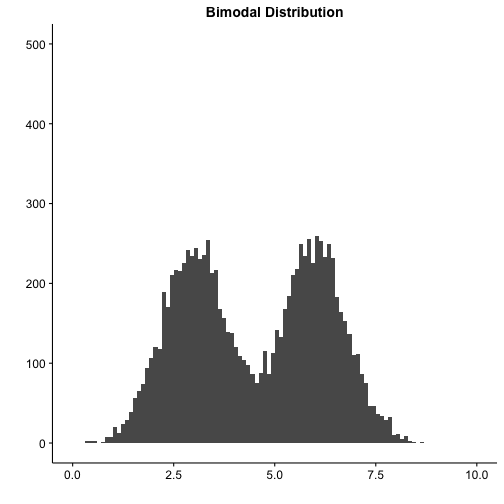
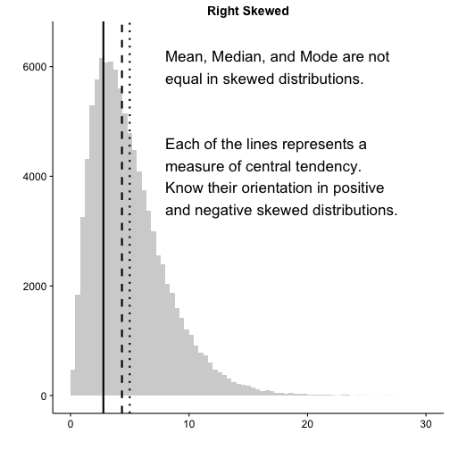
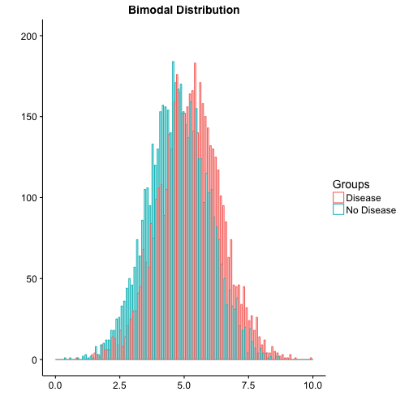

<style>
em {
  font-style: italic
}
</style>
<style>
strong {
  font-weight: bold;
}
body {
  background-color: #000;
}
</style>

## Roadmap

 - Biostatistics - 20 minutes
  - Accuracy versus Precision - 2 minutes
  - Statistical Inference - 3 minutes
  - Distributions - 5 minutes
  - Hypothesis Testing - 10 minutes
 - Epidemiology - 40 minutes
  - Types of Prevention - 2 minutes
  - Types of Outbreaks - 2 minutes
  - Measures of Morbidity and Mortality - 5 minutes
  - Validity and Reliability of Clinical Tests - 6 minutes
  - Measures of Risk - 10
  - Epidemiological Biases - 5 minutes
  - Types of Studies - 10 minutes

--- &vcenter

<div class="centered"><font size="7">Biostatistics</font size></div>

--- &vcenter

## Accuracy is closeness and Precision is repeatability

<div class="centered"></div>

--- &vcenter

## Use these terms to describe levels of belief

 > - Generalizability
  - How applicable is result to general population
 <br><br><br>
 > - P-value
  - Probability of finding a value this extreme by random chance
 <br><br><br>
 > - Confidence Interval
  - Interval over which real population number is found with a specified probability

--- &vcenter

<div class="centered"><font size="7">Ways to describe distributions of data</font size></div>

--- &twocolumn

## Statistical distributions have invariant properties

***=left


***=right


--- &twocolumn

## Real distributions can have one or multiple peaks

***=left


***=right


--- &twocolumn

## Skew describes the direction of the tail

***=left



***=right


--- &twocolumn

## Question

***=left


***=right
- Which of the following corresponds to the measures of central tendency on the graph?  
 - A. 1: mean, 2: median,  3: mode  
 - B. 2: mean, 1: median,  3: mode  
 - C. 2: mean, 3: median,  1: mode  
 - D. 3: mean, 2: median,  1: mode  
 - E. 3: mean, 1: median,  2: mode  

--- &twocolumn

## Question

***=left


***=right
- Which of the following corresponds to the measures of central tendency on the graph?  
 - A. 1: mean, 2: median,  3: mode  
 - B. 2: mean, 1: median,  3: mode  
 - C. 2: mean, 3: median,  1: mode  
 - __D. 3: mean, 2: median,  1: mode__ 
 - E. 3: mean, 1: median,  2: mode  

--- &vcenter

<div class="centered"><font size="7">Understanding hypothesis testing</font size></div>

--- &vcenter

## The null hypothesis (\(H_0\)) is always the default

 > - Assuming there are two or more groups being compared...
 <br><br><br>
 > - \(H_0\): There is no difference in the means of the groups.
 <br><br><br>
 > - For Step 1, probably safe to assume null is always rejected with \(p < 0.05\).
 <br><br><br>
 > - \(H_A\): The difference between the means of the groups is real.

--- &vcenter

## T-test compares measurements from two groups

 > \(H_0\): There is no difference between the control and disease groups 

--- &vcenter

<div class="centered"><font size="7">Will this be significant?</font size></div>

---

## T-test compares measurements from two groups

 - \(H_0\): There is no difference between the control and disease groups 
 
 - Run the t-test
  
  ```r
  norm1 <- rnorm(5000, mean = 4.75, sd = 1.2)
  norm2 <- rnorm(5000, mean = 5.25, sd = 1.2)
  (t.test(norm1, norm2))$p.value
  ```
  
  ```
  ## [1] 1.506568e-103
  ```
  
 > - Have we rejected the null hypothesis?
  
 > - Yes, we have accepted \(H_A\). There is a difference between control and disease.

---

## Chi-squared test uses categorical (count) data
 > - Two common tests
    > - Test of independence
    > - Goodness-of-fit

 > - Test of independence
    > - \(H_0\): There is no association between the variables under study
    > - \(H_A\): There is an association between the variables under study

 > - Goodness-of-fit
    > - \(H_0\): The number of cases occuring are equal to that expected by chance
    > - \(H_A\): The number of cases occuring are unequal to that expected by chance

--- &vcenter

## Always expect a contingency table for chi-squared

|             | Healthy  | Disease  | Total  |
|-------------|---------:|---------:|-------:|
| Exposed     |     40   |     60   |   100  |   
| Not Exposed |    500   |    400   |   900  |   
| Total       |    540   |    460   |  1000  |   
Table 1: A 2x2 contingency table


|                 | Never Sick  |  Sometimes Sick | Mostly Sick  | Total  |
|-----------------|------------:|----------------:|-------------:|-------:|
| High Exposure   |             |                 |              |        |
| Medium Exposure |             |                 |              |        |
| Low Exposure    |             |                 |              |        |  
| Total           |             |                 |              |        |
Table 2: A 3x3 contingency table

--- &vcenter

## The contingency table can be of any size

|                            | Never Sick  |  Infrequently Sick |  Sometimes Sick |  Mostly Sick |  Always Sick |  Total |
|----------------------------|------------:|-------------------:|----------------:|-------------:|-------------:|-------:|
| Ridiculously High Exposure |             |                    |                 |              |              |        |
| Very High Exposure         |             |                    |                 |              |              |        |
| High Exposure              |             |                    |                 |              |              |        |
| Medium Exposure            |             |                    |                 |              |              |        |
| Low Exposure               |             |                    |                 |              |              |        | 
| Very Low Exposure          |             |                    |                 |              |              |        |
| Ridiculously Low Exposure  |             |                    |                 |              |              |        |
| Total                      |             |                    |                 |              |              |        |
Table 3: A 7x5 contingency table

--- &vcenter

## Pearson correlation compares two variables
The correlation can be positive or negative


--- &twocolumn

## For correlation, r is the critical statistic
***=left
 > - Must be quantitative data
  - **Not count data**
 <br><br>
 > - \(r =\) correlation between variables
 <br><br>
 > - \(r^2 = \) amount of variance in y that is explained by x
 <br><br>
 > - p-value is still used for significance
  - For Step 1, most likely significant at \(p < 0.05\)

***=right


--- &vcenter

<div class="centered"><font size="7">Epidemiology</font size></div>

---
