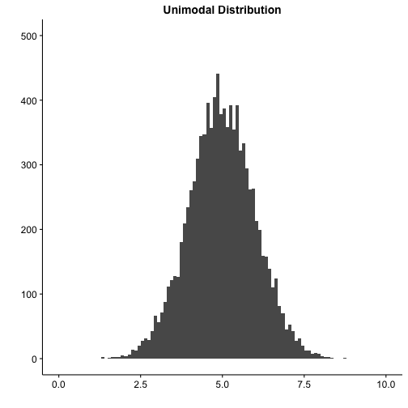
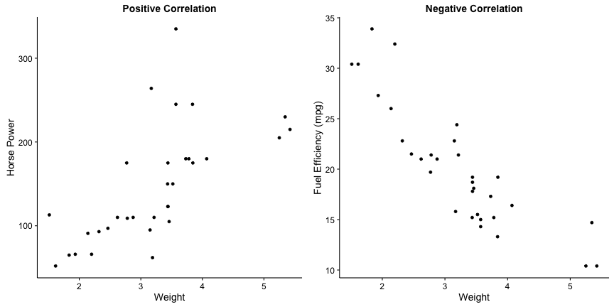
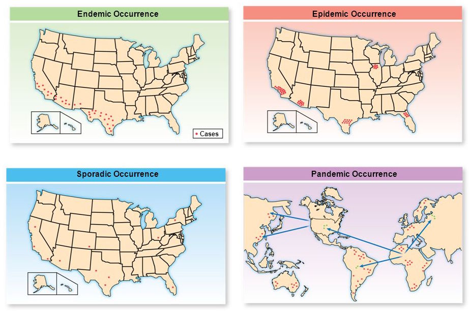
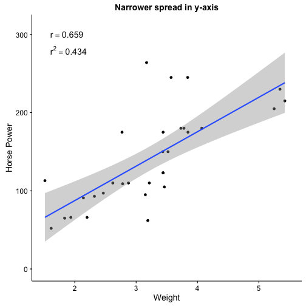
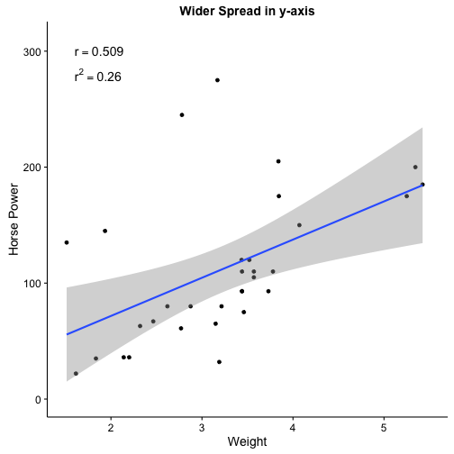

<style>
em {
  font-style: italic
}
</style>
<style>
strong {
  font-weight: bold;
}
body {
  background-color: #000;
}
</style>

<!-- Limit image width and height -->
<style type="text/css">
img {     
  max-height: 500px;     
  max-width: 900px; 
}
</style>

## Roadmap

 - Biostatistics - 20 minutes
  - Accuracy versus Precision - 2 minutes
  - Statistical Inference - 3 minutes
  - Distributions - 5 minutes
  - Hypothesis Testing - 10 minutes
 - Epidemiology - 40 minutes
  - Types of Prevention - 2 minutes
  - Types of Outbreaks - 2 minutes
  - Measures of Morbidity and Mortality - 5 minutes
  - Validity and Reliability of Clinical Tests - 6 minutes
  - Measures of Risk - 10
  - Epidemiological Biases - 5 minutes
  - Types of Studies - 10 minutes

--- .segue
## Biostatistics

--- &vcenter
## There are some important random terms

> - Generalizability
  - How applicable is result to general population
<br><br>
> - P-value
  - Probability of finding a value this extreme by random chance
<br><br>
> - Confidence Interval
  - Interval over which real population number is found with a specified probability
<br><br>
> - Efficacy
<br><br>
> - Effectiveness

--- &vcenter
## Accuracy is closeness and Precision is repeatability


--- .segue
## Describing Distributions

--- &twocolumn
## Statistical distributions have invariant properties

***=left


***=right


---  &radio
## Question #1

Investigators are studying prostate specific antigen (PSA) as a predictor of prostate cancer. To make the statistics easier, they are going to assume that PSA is a normally distributed population variable. Which of the following is correct under their assumption?

1. Mode is greater than median
2. Median is greater than mode
3. 95% CI depends on degrees of freedom
4. _Median is equal to mean_
5. Mean is equal to standard deviation

***.hint
The normal distribution is unimodal and symmetric.

***.explanation
The important invariant properties (for you) of normal distributions are the following:

1. Mean = Median = Mode
2. Unimodal
3. Symmetric
4. Area under curve is 1
5. Constant relationship between standard deviation and percentiles

--- &twocolumn
## Real distributions can have one or multiple peaks

***=left



***=right


--- &twocolumn
## Skew describes the direction of the tail

***=left


***=right


--- &radio2
## Question #2

Which of the following corresponds to the measures of central tendency on the graph from **left to right**? 

1. mean, median, mode
2. mode, mean, median
3. median, mode, mean
4. _mode, median, mean_
5. mean, mode, median

 
***=image


***.hint
Mode is most common, median is middle, mean is average value.

***.explanation
Always remember that the y-axis on these plots are counts or frequency. Therefore, which line is closest to the peak on the y-axis is the mode. The median is **always** in the middle. The mean is the most susceptible to outliers so in a skewed distribution it will **always** be farthest out on the tail.

--- .segue
## Hypothesis Testing

--- &vcenter
## The null hypothesis (\(H_0\)) is always the default

> - Assuming there are two or more groups being compared...
<br><br><br>
> - \(H_0\): There is no difference in the means of the groups.
<br><br><br>
> - For Step 1, probably safe to assume null is always rejected with \(p < 0.05\).
<br><br><br>
> - \(H_A\): The difference between the means of the groups is real.

--- &twocolumn
## T-test compares means of one or two groups

***=left


***=right 
<br><br>
> - One sample: \(H_0\) = There is no difference between group mean and zero
<br><br>
> - Two sample: \(H_0\) = There is no difference between the disease and control groups
<br><br>
> - Paired: \(H_0\) = The difference of a measured variable between two time points on the same individuals is zero

--- &vcenter
<div class="centered"><font size="7">Will the plot be significant?</font size></div>

--- &vcenter
## T-test compares means of one or two groups

 - Two sample: \(H_0\) = There is no difference between the disease and control groups
 <br>
 - Run the t-test
  
  ```r
  norm1 <- rnorm(5000, mean = 4.75, sd = 1.2)
  norm2 <- rnorm(5000, mean = 5.25, sd = 1.2)
  (t.test(norm1, norm2))$p.value
  ```
  
  ```
  ## [1] 1.505077e-95
  ```
  > - Have we rejected the null hypothesis?
  <br>
  > - Yes, we have accepted \(H_A\). There is a difference between control and disease.

--- &vcenter
## Chi-squared test uses categorical (count) data

> - Two common tests
 - Test of independence
 - Goodness-of-fit
> - Test of independence
 - \(H_0\): There is no association between the variables under study
 - \(H_A\): There is an association between the variables under study
> - Goodness-of-fit
 - \(H_0\): The number of cases occuring are equal to that expected by chance
 - \(H_A\): The number of cases occuring are unequal to that expected by chance

--- &vcenter
## Always expect a contingency table for chi-squared

|             | Healthy  | Disease  | Total  |
|-------------|---------:|---------:|-------:|
| Exposed     |     40   |     60   |   100  |   
| Not Exposed |    500   |    400   |   900  |   
| Total       |    540   |    460   |  1000  |   
Table 1: A 2x2 contingency table


|                 | Never Sick  |  Sometimes Sick | Mostly Sick  | Total  |
|-----------------|------------:|----------------:|-------------:|-------:|
| High Exposure   |      10     |     20          |   180        |  210   |
| Medium Exposure |      20     |    100          |    20        |  140   |
| Low Exposure    |     100     |     40          |    10        |  150   |  
| Total           |     130     |    160          |   210        |  500   |
Table 2: A 3x3 contingency table

--- &vcenter
## The contingency table can be of any size

|                            | Never Sick  |  Infrequently Sick |  Sometimes Sick |  Mostly Sick |  Always Sick |  Total |
|----------------------------|------------:|-------------------:|----------------:|-------------:|-------------:|-------:|
| Ridiculously High Exposure |     10      |          90        |       34        |      12      |    12        |   158  |
| Very High Exposure         |     30      |         345        |       54        |      43      |    21        |   493  |
| High Exposure              |     70      |          57        |       67        |      65      |    32        |   291  |
| Medium Exposure            |    200      |          33        |       87        |      25      |    42        |   387  |
| Low Exposure               |    130      |          89        |       58        |      45      |    56        |   378  | 
| Very Low Exposure          |    100      |          54        |       36        |      23      |    78        |   291  |
| Ridiculously Low Exposure  |     90      |          23        |       36        |      63      |     8        |   220  |
| Total                      |    530      |         691        |      372        |     276      |   249        |  2118  |
Table 3: A 7x5 contingency table

--- &vcenter
## Pearson correlation compares two variables
The correlation can be positive or negative



--- &twocolumn
## For correlation, r is the critical statistic
***=left
<br>
> - Must be quantitative data
 - **Not count data**
<br><br>
> - \(r =\) correlation between variables
<br><br>
> - \(r^2 = \) amount of variance in y that is explained by x
<br><br>
> - p-value is still used for significance
 - For Step 1, most likely significant at \(p < 0.05\)

***=right


---  &radio
## Question #3

Investigators developed a new serum biomarker as a predictor for prostate cancer. To test it, they plan a cross-sectional study compromised of two groups. In one group, the researchers will include measurements of men with biopsy confirmed prostate cancer. In the other group, researchers will measure the level of their biomarker in men that have never previously been diagnosed with prostate cancer nor had a positive PSA test. The investigators will assume their biomarker is normally distributed. What is the best test to investigate whether the biomarker can distinguish the two groups?

1. Two sample Mann-Whitney U-test
2. Pearson correlation
3. _Two sample T-test_
4. Chi-squared test
5. Analysis of variance

***.hint
The number of groups and distribution is all that matters

***.explanation
The two sample T-test is the appropriate test in this case. The two sample Mann-Whitney U-test could work as well, but is slightly less efficient for normally distributed data than the T-test. The Pearson correlation requires two measured variables on the same sample. A chi-squared test requires categorical (i.e. count) data. An analysis of variance is typically used to measure the difference in means of three or more groups.

--- &twocolumn
## Hypothesis testing has four possible outcomes

***=left


***=right
<br>
> - Correct - Reject a false \(H_0\)
 - Probability of success is called "power"
> - Correct - Fail to reject a true \(H_0\)
 - Probability determined by \(\alpha\) as \(1-\alpha\)
<br><br><br>
> - Type 1 - Incorrect rejection of a true \(H_0\)
 - False Positive
> - Type 2 - Failure to reject a false \(H_0\)
 - False Negative

--- .segue
## Epidemiology

--- &vcenter
## Types of prevention
  
> - Primary - __Prevention__
  - An action taken to prevent development of disease in a person who is well
  <br><br>
> - Secondary - __Screening__
  - Identifying people in whom disease has begun but who do not have signs or symptoms
  <br><br>
> - Tertiary - __Treatment__
  - Preventing complications in those who have developed signs and symptoms and have been diagnosed

--- &vcenter
## Endemic vs Sporadic vs Epidemic vs Pandemic



--- &vcenter
## Important difference is in setting and time frame
  
> - Attack rate
  - Typically used during epidemics
  - Number of people who get disease / Number of people who are exposed

> - Incidence
  - Given a __defined period of time__ and an at-risk population
  - Number of people with disease / Number of people who are exposed

> - Prevalence
  - Given an at-risk population
  - __No time frame__
  - Number of people with disease/Number of people who are exposed
  - For steady-state SIR diseases
    - Prevalence = Incidence x Average Disease Duration

--- &vcenter
## Tests are usually cutoffs on a continuous variable
  


--- &vcenter
## Sensitivity is true positives / number with disease
  


--- &vcenter
## Specificity is true negatives / number w/o disease
  


--- &twocolumn
## PPV and NPV vary based on pre-test probability
  
***=left


***=right
> - Positive Predictive Value
  - Chance that person has the disease after a positive test result
  - \(PPV = TP / (TP + FP)\)
<br><br>
> - Negative Predictive Value
  - Chance that person does not have disease after a negative test result
  - \(NPV = TN / (TN + FN)\)
<br>  
> - __Both depend on how prevalent the disease is in the population__

--- &radio2
## Question #4

Assume a steady-state population that is not changing in anyway. Which of the following statements is true for people who test positive regarding moving the cutoff for a positive test from the solid to the dotted line?

1. Decrease in test specificity
2. Increase in test sensitivity
3. _Increase in PPV_
4. Increase in NPV
5. Decrase in NPV

***=image


***.hint
Question prefaces a positive test result

***.explanation
1. Incorrect - Moving the line to the right increases the specificity because it captures more true negatives as a portion of total negative individuals
2. Incorrect - Moving the line to the right decreases the sensitivity because it captures fewer true positives as a portion of total positive individuals
3. Correct - Moving the line to the right increase positive predictive value drives up the portion of true positives to total positive test by reducing the number of false positives
4. Incorrect - The question is concerned about positives tests which do not factor into negative predictive value
5. Incorrect - The question is concerned about positives tests which do not factor into negative predictive value

--- &twocolumn

## Odds and risk connect disease with exposure

***=left

> - Odds 
  - Risk that someone with an exposure will get disease
> - Odds ratio
  - Excess odds of exposure of one population relative to another
<br><br>
> - Risk - __Must know the prevalence__
  - __Probability__ that someone with an exposure will get a disease
> - Risk Ratio (Relative Risk)
  - Excess risk of one population relative to another

***=right


--- &radio

## Question #5

Investigators are studying the association between mesothelioma and asbestos exposure. Due to the relative rarity of the disease, they design a very large case-control study. In the end, they find an \(OR = 20 (19.54;20.52, p < 0.001)\). After assuming that the OR is a good approximation of risk, the authors conclude that the risk of mesothelioma is 20 times higher in those exposed to asbestos compared to control. Why is their assumption reasonable?

1. _The incidence of mesothelioma in the population is low_
2. The sample size of this study is very large
3. The result is highly significant
4. The OR is always a good approximation of outcome risk
5. The 95% CI is very narrow around the OR of 20

***.hint
Think about the denominators for odds and risks.

***.explanation
Give an explanation

--- &vcenter

## OR approximates RR in low prevalence diseases


--- &vcenter

## Attributable risk is an incidence difference


--- &twocolumn

## Absolute risk reduction is a risk difference

<br>
***=left
> - Reminder
  - Exposed: \(Risk = A / (A + B)\)
  - Unexposed: \(Risk = C / (C + D)\)
<br><br>
> - \(ARR = Risk_{Unexposed} - Risk_{Exposed}\)
> - \(ARR = Risk_{Control} - Risk_{Treatment}\)
<br><br>
> - Number needed to treat
  - Number of patients treated for __ONE__ patient benefited
  - \(NNT = 1 / ARR\)

***=right

